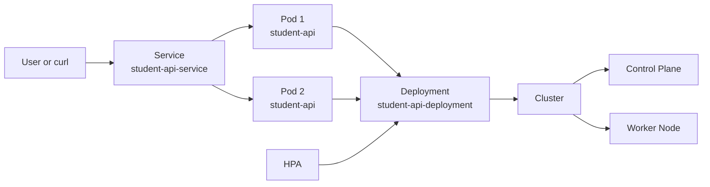

# Student API Kubernetes Architecture

Control Plane нь desired state-ийг хадгалж, Worker Node дээр pod-ууд ажиллана. HPA нь CPU ачааллаас хамаарч Deployment-ийн replica тоог 2-оос 5 хүртэл өсгөж эсвэл бууруулна.
